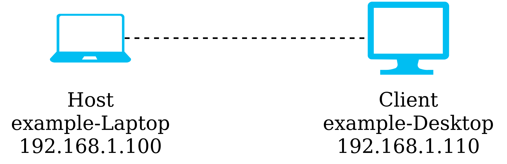

# remote_ros
Instructions on how to run ROS in a distributed computing environment.

## Usage


There are two ways of setting up ros for distributed computing. The hostname and direct IP.
 - Hostname, good for networks with dynamic IP. Might fail on some networks when DNS is not configured correctly. (Usually computer-name.local)
 - Direct IP, good for networks with static IP. More robust and allows for direct specification of network adaptors to use.

<sup>Setting up networks and network DNS is outside the scope of this documentation.</sup>

First test if both computer has network connectivity to each other by pinging.

### On the host
```ping example-Desktop.local```

```ping 192.168.1.110```

### On the client
```ping example-Laptop.local```

```ping 192.168.100```

Once either the hostname ping or IP ping works out, before running `roscore` or any ros programs run the following on both machines,

### On the host
```
export ROS_HOSTNAME=example-Laptop.local
export ROS_MASTER_URI=http://example-Laptop.local:11311
```
or
```
export ROS_IP=192.168.1.100
export ROS_MASTER_URI=http://192.168.1.100:11311
```

### On the client
```
export ROS_HOSTNAME=example-Desktop.local
export ROS_MASTER_URI=http://example-Laptop.local:11311
```
or
```
export ROS_IP=192.168.1.110
export ROS_MASTER_URI=http://192.168.1.100:11311
```

Note that for the client's `ROS_MASTER_URI` the host machine's details are used, more advanced users can change the `roscore` port on the host machine by changing `:11311`.

---

You can save time by saving the export lines to a text file, i.e. with the exports in `~/remoteROS`,

```
source devel/setup.bash
source ~/remoteROS
```

---

Confirm the link by running `rqt_graph` or `rostopic list` on the client machine.

## Further notes
Theoretically this should also allow for running a ROS host on a remote machine over the internet, however in the use case of having a simulation environment (Gazebo) and a control node seperate may impart latency causing to the simulation to act weirdly. It is best to only run control nodes on a distributed machine with a direct ethernet line.

Using this method for passing visualisation data to a client machine over the internet should be fine. However the setup of such a network is outside the scope of this document.
